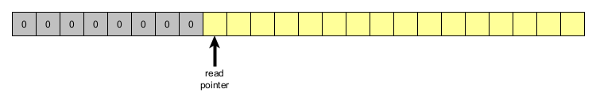

# Introduction

This repository presents a software that can be used to hide a (secret) message into a series of emails.

Please note that this is a **PROOF OF CONCEPT**. This software, as it is, works. However, it is not easy to 
use and its UI is bad. Many things should be improved:

* the algorithm used for encryption. The currently used algorithm is super strong. _But it is not convenient at all_.
* the UI. The current text based UI is very basic. A GUI would be much better.
* only secure SMTP and secure IMAP are supported.

The way the software works is that it hides messages within the boundaries defined by MIME.

# Build

Compile: 

```
go build
```

Test:

```
go clean & go clean -testcache & go test -p 1 ./...
```

# Typical use case

## Scenario

Bill (`bill@posteo.net`) is sending a hidden message to John (`john@posteo.net`).

The secret message is:

```
This is the secret message!
You cannot detect it.
You cannot read it!
```

Prior to this sending, Bill and John have exchanged a secret key in the form of a very long file that contains
randomly generated bytes.

## Create a secret key

The secret key is composed of 2 parts:
* an index, which is an 8 bytes long signed integer (`int64`), written in little endian byte order.
* a list of randomly generated bytes.

> The value of the index is initialized to 0. It represents the position, relatively to the
> beginning of the file, of the "read pointer". At the beginning, the "read pointer" is positioned
> at the beginning of the file (position 0 <=> ninth byte of the file).
> 
> Each time you use the key (to encrypt or decrypt), the read pointer is moved forward into the file
> (and the index is incremented accordingly).



Create a secret key (used for encryption and decryption) from a file that contains random data.
**This secret key must be shared between the sender and the receiver (because... it's a _secret_ key).**

```
umail.exe create-key test random-data.bin
dir "%HOMEDRIVE%%HOMEPATH%\.smailer\keys"
dir "%HOMEDRIVE%%HOMEPATH%\.smailer\sessions"
```

> * Please note that the file "`random-data.bin`" should be generated using a true random number generator (such as the [OneRNG](https://onerng.info/)).
>   But, if you don't have a true random number generator, you can generate this file using this PowerShell command:
>   `$out = new-object byte[] 1048576; (new-object Random).NextBytes($out); [IO.File]::WriteAllBytes('random-data.bin', $out)`.
>   (this is not a very secure method, though)
> * The name of the key is "`test`".
 
Print information about the previously generated key:

```
umail.exe info-key test
```

The result may be, for example:

```
file: "C:\Users\.smailer\keys\test"
current read position: 0
```

> Please note that the current position of the "read pointer" within the (encryption and decryption) key is `0`.
> This means that the key is used for the first time.

## Send a hidden message

Create a _session_. A _session_ contains the message to hide.

```
umail.exe create-session --key=test --message=message.txt first-session
dir "%HOMEDRIVE%%HOMEPATH%\.smailer\sessions"
type "%HOMEDRIVE%%HOMEPATH%\.smailer\sessions\first-session"
```

> Here, we create the session called "`first-session`".
> This session contains the message to hide, which is read from the file "`message.txt`".
> And you notice that the message to hide is encoded using the key "`test`" that we've previously created.

Here is an example of message to hide (content of the file "`message.txt`"):

```
C:\Users\Documents\github\umail>type message.txt
This is the secret message!
You cannot detect it.
You cannot read it!
```

You can print information about the previously created session:

```
umail.exe info-session first-session
```

The result may be, for example:

```
name: "first-session" (C:\Users\.smailer\sessions\first-session)
pool: "test" (C:\Users\.smailer\keys\test) at 0
email sent: 0
boundaries (3):
[  0]  [165, 202, 207, 214, 176, 183, 144, 90, 56, 215, 116, 243, 206, 0, 241, 151, 75, 191, 76, 43, 168, 148, 169, 61, 67, 31, 248, 174, 7, 86, 227, 221, 195, 164, 249] (len: 35)
=> "a5cacfd6b0b7905a38d774f3ce00f1974bbf4c2ba894a93d431ff8ae0756e3ddc3a4f9"
[  1]  [127, 177, 207, 244, 112, 138, 39, 165, 218, 69, 212, 87, 121, 188, 199, 92, 188, 218, 181, 5, 135, 136, 108, 238, 59, 75, 139, 98, 155, 46, 9, 138, 187, 35, 70] (len: 35)
=> "7fb1cff4708a27a5da45d45779bcc75cbcdab50587886cee3b4b8b629b2e098abb2346"
[  2]  [75, 242, 18, 9, 97, 128, 56, 13, 29, 127, 74, 145, 46, 120, 51, 86, 172, 236, 116, 240, 31, 131, 20, 63, 250, 25, 250, 209, 177, 181, 194, 89, 197, 54, 139] (len: 35)
=> "4bf212096180380d1d7f4a912e783356acec74f01f83143ffa19fad1b1b5c259c5368b"
number of emails to send: 3
```

As you can see:
* The session uses the (encryption / decryption) key "`test`". The key is used from the position `0`. 
* You will need to send 3 emails in order to send the entire hidden message.
* Currently, no email has been sent yet (`email sent: 0`).

Now, we can send the (3) emails. Thus, first, you need to write 3 texts that you will save into 3 files.
For example:
* file "`email1.txt`": _Hello my dear friend..._
* file "`email2.txt`": _Oh, I've forgotten to tell you..._
* file "`email3.txt`": _Hello again! How is it going ?..._

> Please note that the files must be saved as **UTF-8** encoded files.

Send the first email (`BODY=email1.txt`):

```
SET FROM=bill@posteo.net
SET SMTP_SERVER=posteo.de
SET SMTP_PORT=465
SET SMTP_PASSWORD=BillSuperPassword
SET TO=john@posteo.net
SET BODY=email1.txt
SET SUBJECT="Hello John! What's up?"

umail.exe send --smtp=%SMTP_SERVER% ^
    --port=%SMTP_PORT% ^
    --password=%SMTP_PASSWORD% ^
    --body=%BODY% ^
    --key=test ^
    first-session %FROM% %TO% %SUBJECT%
```

Response: `Number of emails sent: 1 (over 3)`

Send the second email (`BODY=email2.txt`):

```
SET FROM=bill@posteo.net
SET SMTP_SERVER=posteo.de
SET SMTP_PORT=465
SET SMTP_PASSWORD=BillSuperPassword
SET TO=john@posteo.net
SET BODY=email2.txt
SET SUBJECT="Hello John! By the way..."

umail.exe send --smtp=%SMTP_SERVER% ^
    --port=%SMTP_PORT% ^
    --password=%SMTP_PASSWORD% ^
    --body=%BODY% ^
    --key=test ^
    first-session %FROM% %TO% %SUBJECT%
```

Response: `Number of emails sent: 2 (over 3)`

Send the third (and last) email (`BODY=email3.txt`):

```
SET FROM=bill@posteo.net
SET SMTP_SERVER=posteo.de
SET SMTP_PORT=465
SET SMTP_PASSWORD=BillSuperPassword
SET TO=john@posteo.net
SET BODY=email3.txt
SET SUBJECT="So how is it going?"

umail.exe send --smtp=%SMTP_SERVER% ^
    --port=%SMTP_PORT% ^
    --password=%SMTP_PASSWORD% ^
    --body=%BODY% ^
    --key=test ^
    first-session %FROM% %TO% %SUBJECT%
```

Response:

```
Number of emails sent: 3 (over 3)
The session has been entirely processes.
```

If you print information about the session:

```
umail.exe info-session first-session
```

The result may be, for example:

```
name: "first-session" (C:\Users\.smailer\sessions\first-session)
pool: "test" (C:\Users\.smailer\keys\test) at 0
email sent: 3
boundaries (3):
[  0]  [132, 7, 215, 232, 20, 45, 236, 130, 180, 140, 61, 237, 174, 149, 200, 131, 8, 18, 17, 144, 143, 86, 104, 197, 66, 44, 184, 72, 62, 173, 91, 57, 111, 106, 196] (len: 35)
       => "8407d7e8142dec82b48c3dedae95c883081211908f5668c5422cb8483ead5b396f6ac4"
[  1]  [129, 171, 245, 208, 182, 176, 144, 87, 46, 131, 101, 248, 223, 0, 235, 134, 6, 192, 35, 6, 231, 140, 236, 45, 81, 16, 241, 164, 82, 123, 155, 225, 205, 181, 249] (len: 35)
       => "81abf5d0b6b090572e8365f8df00eb8606c02306e78cec2d5110f1a4527b9be1cdb5f9"
[  2]  [117, 164, 128, 154, 31, 254, 7, 193, 191, 49, 177, 52, 13, 156, 174, 40, 146, 215, 191, 92, 232, 253, 76, 141, 90, 37, 229, 13, 239, 14, 123, 239, 218, 71, 102] (len: 35)
       => "75a4809a1ffe07c1bf31b1340d9cae2892d7bf5ce8fd4c8d5a25e50def0e7befda4766"
number of emails to send: 0
```

## Get the hidden message

**BIG WARNING**

**If you are testing this program from a single computer, chances are that you use the same "key file" (associated with 
the key "`test`") for encryption and decryption. Keep in mind that the "key file" is just a very long list of (randomly 
generated) bytes. Bytes (within this "key file") are used "as needed", and each time a byte is used, it is discarded.
Thus, if you used the "key file" for encryption, you cannot use the same "key file" cannot be used for decryption,
unless you "reactivate" the bytes that have been discarded (by the encryption process). To do that, for the current 
example, just run: `umail.exe reset-key test 0`. But be aware that the last argument (`0`) may change depending on 
the context (see note below: `pool: "test" (C:\Users\.smailer\keys\test) at 0`).**

> ```
> C:\Users\Documents\github\umail> umail.exe info-session first-session
> name: "first-session" (C:\Users\.smailer\sessions\first-session)
> pool: "test" (C:\Users\.smailer\keys\test) at 0
> email sent: 0
> boundaries (3):
> [  0]  [165, 202, 207, 214, 176, 183, 144, 90, 56, 215, 116, 243, 206, 0, 241, 151, 75, 191, 76, 43, 168, 148, 169, 61, 67, 31, 248, 174, 7, 86, 227, 221, 195, 164, 249] (len: 35)
> => "a5cacfd6b0b7905a38d774f3ce00f1974bbf4c2ba894a93d431ff8ae0756e3ddc3a4f9"
> [  1]  [127, 177, 207, 244, 112, 138, 39, 165, 218, 69, 212, 87, 121, 188, 199, 92, 188, 218, 181, 5, 135, 136, 108, 238, 59, 75, 139, 98, 155, 46, 9, 138, 187, 35, 70] (len: 35)
> => "7fb1cff4708a27a5da45d45779bcc75cbcdab50587886cee3b4b8b629b2e098abb2346"
> [  2]  [75, 242, 18, 9, 97, 128, 56, 13, 29, 127, 74, 145, 46, 120, 51, 86, 172, 236, 116, 240, 31, 131, 20, 63, 250, 25, 250, 209, 177, 181, 194, 89, 197, 54, 139] (len: 35)
> => "4bf212096180380d1d7f4a912e783356acec74f01f83143ffa19fad1b1b5c259c5368b"
> number of emails to send: 3
> ```

In the previous section, we sent 3 emails (that together hide the secret message).
And we used the key which name is "`test`" for encryption.

The messages' sender is `bill@posteo.net`. Thus, we can filter the received emails on that email address.
However, this filtration is optional. You can choose to display all the received emails.

```
SET IMAP_SERVER=posteo.de
SET IMAP_PORT=993
SET IMAP_USER=john@posteo.net
SET IMAP_PASSWORD=JohnSuperPassword
SET FROM=bill@posteo.net

umail.exe rcv --imap=%IMAP_SERVER% ^
--port=%IMAP_PORT% ^
--user=%IMAP_USER% ^
--password=%IMAP_PASSWORD% ^
--from=%FROM%
```

The user will be presented with a list of emails sent by `bill@posteo.net`.
Then he will be asked for the indexes of the emails to the process. In our case, it will be: 2, 3 and 4.

> Please note that `bill@posteo.net` may have sent emails that don't hide anything. In this case, these emails
> must be ignored. You must indicate the emails used to hide the message.

Then the user must confirm his choice and enter the name of the key used to decrypt the message (in our case, 
the name of the key is "`test`"). 

```
EMAILS:

[   2] 2023-08-23 09:21:05 +0200 CEST (1692775265)
Subject: stégano 1
From: denis.beurive@posteo.net
To: denis.beurive@posteo.net
Boundary: 8407d7e8142dec82b48c3dedae95c883081211908f5668c5422cb8483ead5b396f6ac4

[   3] 2023-08-23 09:21:19 +0200 CEST (1692775279)
Subject: stégano 2
From: denis.beurive@posteo.net
To: denis.beurive@posteo.net
Boundary: 81abf5d0b6b090572e8365f8df00eb8606c02306e78cec2d5110f1a4527b9be1cdb5f9

[   4] 2023-08-23 09:21:35 +0200 CEST (1692775295)
Subject: stégano 3
From: denis.beurive@posteo.net
To: denis.beurive@posteo.net
Boundary: 75a4809a1ffe07c1bf31b1340d9cae2892d7bf5ce8fd4c8d5a25e50def0e7befda4766

List of emails to process (type 'x' to quit):
2 3 4
You selected: 2, 3, 4
Proceed ? (y/n) y
[   2] 8407d7e8142dec82b48c3dedae95c883081211908f5668c5422cb8483ead5b396f6ac4
[   3] 81abf5d0b6b090572e8365f8df00eb8606c02306e78cec2d5110f1a4527b9be1cdb5f9
[   4] 75a4809a1ffe07c1bf31b1340d9cae2892d7bf5ce8fd4c8d5a25e50def0e7befda4766
Enter the name of the key to use: test
Lenght of the (hidden) message: 71
The hidden message is:

This is the secret message!
You cannot detect it.
You cannot read it!
```

